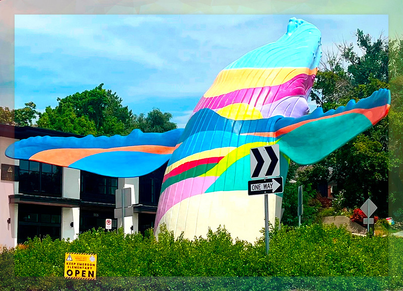

# Keep Emerson Elementary Open 

Hello, we are members of the Emerson Elementary community.

Emerson is a public elementary school in Salt Lake City, Utah that is currently on a list for potential closure despite the fact that it is a top performing school in the state and has been [nationally recognized](https://nationalblueribbonschools.ed.gov/awardwinners/winning/21ut102pu_emerson_elementary_school.html) due to its academic and special education programs.

Our mission is to create a hub for gathering and sharing information about Emerson with a passionate determination to ensure its continued operation.

## Per the [school district's policy](https://resources.finalsite.net/images/v1644869018/slcschoolsorg/da6w2cajvlh3tpfsacb0/g-5-policy-english.pdf), "all applicable factors will be considered" regarding school closures, including but not limited to the following:

- Enrollment data
- Facility capacity and design
- School feeder patterns (_the movement of students into higher level schools_)
- Federal, state, or court mandates
- Community input
- Student safety
- Transportation capacity
- Community and neighborhood identity
- Geographic features of the district
- Special program facilities
- Environmental factors
- Demographics
- Aesthetics
- Financial implications
- Educational programs

This site aims to provide insights into each of these factors, underscoring their significance in the preservation of Emerson Elementary.

## Accessibility and Safety

- Emerson is not in a major thoroughfare like 700 East so students are not playing by busy roads or having to cross 6-car lane traffic to get to/from school.
- Emerson still serves a lot of students in the neighborhood and a lot of parents in the community bike or walk their kids to/from school (some, out of necessity).
- Redistricting of the children in Emerson’s boundaries will mean further walking distances, either across busy 700 East or up difficult (snowy hills during winter) on 1300 South.
- Emerson is the only school in the district with two aftercare programs within .5 miles of walking distance from the school (St John's CCDC Sugarhouse and Arte Primero Studios).
- Classes are able to have safe walking field trips around the community (Free Little Libraries, parks, post office, etc.).
- The city is also [improving 1100 East](https://www.slc.gov/mystreet/2022/12/12/1100east/) near Emerson to “provide safety improvements, traffic calming features, and bicycle lanes along the corridor.”

## Enrollment Trends

Emerson continues to serve a significant number of students from its local neighborhood. As per the [district's definition](https://www.slcschools.org/departments/information-technology/boundaries-and-planning/population-and-boundary-study/population-and-boundary-study-faq#fs-panel-80237) of “right-sized elementary school,” Emerson maintains a ratio of about three teachers per grade and offers full-day kindergarten classes. In Utah, parents have the choice of [open enrollment](https://le.utah.gov/xcode/Title53G/Chapter6/53G-6-S402.html) and many choose Emerson for its commitment to excellence.
Despite declining enrollment rates cited as a reason for potential closures, Emerson operates at 85% student capacity, marking the second-highest enrollment rate within the Salt Lake City School District. The table sourced from the [State Board of Education](https://www.schools.utah.gov/data/reports?mid=1424&tid=4) emphasizes in bold the enrollment rates for Emerson as well as the other schools on the list for potential closure.

| School Name             | % of Capacity |
|-------------------------|--------------:|
| Backman School          |           54% |
| Beacon Heights School   |           63% |
| Bonneville School       |           75% |
| Dilworth School         |           76% |
| Edison School           |           59% |
| **Emerson School**      |           85% |
| Ensign School           |           52% |
| Escalante School        |           53% |
| Franklin School         |           45% |
| **Hawthorne School**    |           66% |
| Highland Park School    |           82% |
| Indian Hills School     |           50% |
| Liberty School          |           55% |
| **M. Lynn Bennion School** |         26% |
| **Mary W. Jackson School** |        63% |
| Meadowlark School       |           57% |
| Mountain View School    |           86% |
| **Newman School**       |           42% |
| Nibley Park School      |           46% |
| North Star School       |           53% |
| Parkview School         |           34% |
| **Riley School**        |           35% |
| Rose Park School        |           45% |
| Uintah School           |           75% |
| **Wasatch School**      |           56% |
| Washington School       |           36% |
| Whittier School         |           69% |

## Proximity to Other Schools

In Central City, a staggering four out of the seven schools find themselves on the list "recommended for further study for potential closure." Among them, Emerson and Hawthorne, situated in close proximity, face an uncertain future. Additionally, Bennion and Wasatch are also part of this list. Notably, these four schools represent a substantial portion of the city, from lower Avenues to Sugarhouse.

The potential loss of these four schools would significantly impact the fabric of this area, which can also be challenging to fill in the future. Emerson is a vital cornerstone of our community.

## Cost to Operate (building, utilities, etc.)

Sourced from the [Salt Lake School District Sustainability Action Plan](https://resources.finalsite.net/images/v1641931356/slcschoolsorg/irjphywgl0dtrb8n8in0/sustainability-resolution-english.pdf), Emerson has 6th lowest utility cost per student, 5th lowest emissions per student, 12th lowest Energy Use Intensity ('miles per gallon' of the school), and 9th lowest water usage compared to all elementary schools in the district.

Emerson has recently invested in upgrades that made the school energy-efficient, with energy-saving lights and an installation of solar panels. These enhancements are projected to further lower the school's energy costs, ensuring a greener and more eco-conscious future.

Beyond its commitment to sustainability, Emerson thrives as a close-knit and proactive community. The dedication of parents, teachers, and supporters knows no bounds, as evidenced by consistently surpassing fundraising goals. This remarkable achievement not only demonstrates unwavering community support but also paves the way for enriching educational experiences.

Emerson parents volunteer at the school every day. Their active involvement not only fosters an inspiring learning environment where students flourish but also serves as a cost-saving measure for the school. With dedicated volunteers generously giving their time and talents, the school can allocate resources more efficiently, redirecting funds towards enriching educational programs and further enhancing the student experience. Students are nurtured by the care and encouragement of those around them, benefiting from the invaluable contributions of our dedicated volunteers.

## Ask the School Board:

1. On August 1st, did the District change their definition of "right-sizing" schools mid-process to explicitly mean "an average of three neighborhood classrooms per grade level?" What data is this "right-sizing" "educational model" based from?
2. Will the district keep the land if Emerson closes?
3. How much will it cost to close Emerson? What will happen to the "money saved" from closing Emerson?
4. It does not take overnight to rebuild programs in other schools. Emerson is home to a number of established academic and special education programs. What is the timeline to rebuild those programs in which other schools?
5. What school would the Emerson neighborhood students go to if Emerson closes? How is the district going to ensure that support for students who are enrolled in Emerson because of its special education programs will be readily available in another school?

## Other things to note:

- Emerson has a diverse student body as the neighborhood children come from different socioeconomic backgrounds (mixed-income families, renters/property owners, parents with varying jobs they can impart with the student body, etc.). The students are also exposed to different abilities/neurodiversity as teachers, administrators, and staff encourage collaboration of its students.
- The Emerson community values clean air, inclusion, and progress. The city is already trying to better bridge Central City (west and east) with projects like [900 South Reconstruction](https://www.slc.gov/mystreet/2023/02/16/900-south-900-east-to-900-west/) and [Kensington Byway](https://www.slc.gov/transportation/neighborhood-byways/kensington/); Emerson is between these projects.

## Community Input

- [Keep Emerson Open Instagram](https://www.instagram.com/keepemersonopen)
- [You can help keep Emerson open by leaving the Board feedback online.](https://saltlakedistrict.sjc1.qualtrics.com/jfe/form/SV_bm7M6vIXQLQQAHc)
- [You can help keep Emerson open by emailing the Board.](https://www.slcschools.org/board-of-education)
- [You can help keep Emerson open by emailing the Superintendent's Office.](https://www.slcschools.org/departments/superintendents-office)
- [Council Meeting Notes](https://resources.finalsite.net/images/v1689197476/slcschoolsorg/lgzj2vrlba27zbobmgam/EmersonCommunityCouncilMeeting04-12-23.pdf)
- [KUTV: Surprise, School with High Enrollment on Closure List](https://kutv.com/news/crisis-in-the-classroom/parents-shocked-by-salt-lake-schools-listed-for-possible-closure-despite-high-enrollment-emerson-elementary-large-student-body-programs-public-comment)
- [Salt Lake Tribune: Current SLCSD School Closures List Presents Glaring Issues like Equity and Transparency](https://www.sltrib.com/opinion/commentary/2023/07/28/marina-gomberg-wonders-if-proposed/)
- [Salt Lake Tribune: Keep Emerson Elementary Open](https://www.sltrib.com/opinion/commentary/2023/07/21/alyssa-campos-keep-emerson/)
- [Salt Lake Tribune: Invest in Public Education](https://www.sltrib.com/opinion/letters/2023/07/20/letter-potential-closure-salt-lake/)
- [Salt Lake Tribune: Utah Public School Students Deserve More](https://www.sltrib.com/opinion/editorial/2023/07/09/tribune-editorial-utah-public/)

## Emerson Elementary History

Though the current building is from the late 1970’s, Emerson was established in 1894, around the inception of this state (24:01 in [this video](https://youtu.be/14nB6U4BdiM?t=1441)). A book called ["101 Years of Emerson Elementary School: The Gift of Its Inspired Children"](https://catalog.slcpl.org/search/title.aspx?ctx=1.1033.0.0.7&pos=1&cn=56693) is available in the Main SLC Public Library’s Special Collections.

